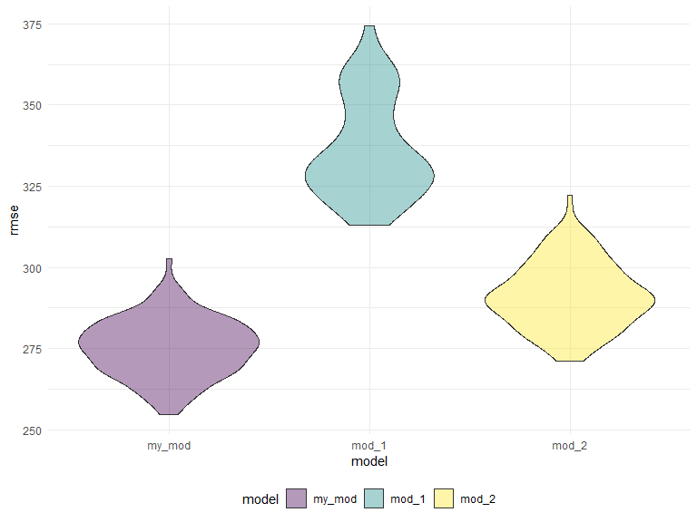

P8105 Hw6
================

``` r
library(tidyverse)
```

    ## -- Attaching packages --------------------------------------- tidyverse 1.3.1 --

    ## v ggplot2 3.3.5     v purrr   0.3.4
    ## v tibble  3.1.5     v dplyr   1.0.7
    ## v tidyr   1.1.4     v stringr 1.4.0
    ## v readr   2.0.2     v forcats 0.5.1

    ## -- Conflicts ------------------------------------------ tidyverse_conflicts() --
    ## x dplyr::filter() masks stats::filter()
    ## x dplyr::lag()    masks stats::lag()

``` r
library(readr)
library(mgcv)
```

    ## Loading required package: nlme

    ## 
    ## Attaching package: 'nlme'

    ## The following object is masked from 'package:dplyr':
    ## 
    ##     collapse

    ## This is mgcv 1.8-38. For overview type 'help("mgcv-package")'.

``` r
library(modelr)

knitr::opts_chunk$set(
  echo = TRUE,
  warning = FALSE,
  fig.width = 8,
  fig.height = 6,
  out.width = "90%"
)

options(
  ggplot2.continuous.colour = "viridis",
  ggplot2.continuous.fill = "viridis"
)

scale_colour_discrete = scale_colour_viridis_d
scale_fill_discrete = scale_fill_viridis_d

theme_set(theme_minimal() + theme(legend.position = "bottom"))
```

# Problem 1

Firstly load and clean the data

``` r
birthweight = read_csv("./data/birthweight.csv")
```

    ## Rows: 4342 Columns: 20

    ## -- Column specification --------------------------------------------------------
    ## Delimiter: ","
    ## dbl (20): babysex, bhead, blength, bwt, delwt, fincome, frace, gaweeks, malf...

    ## 
    ## i Use `spec()` to retrieve the full column specification for this data.
    ## i Specify the column types or set `show_col_types = FALSE` to quiet this message.

``` r
birthweight = 
  birthweight %>% 
  mutate(
    babysex = factor(babysex),
    frace = factor(frace),
    malform = factor(malform),
    mrace = factor(mrace),
    babysex = fct_recode(babysex, "male" = "1", "female" = "2"),
    frace = fct_recode(frace, "White" = "1", "Black" = "2", "Asian" = "3", 
                       "Puerto Rican" = "4", "Other" = "8", "Unkonwn" = "9"),
    malform = fct_recode(malform, "absent" = "0", "present" = "1"),
    mrace = fct_recode(mrace, "White" = "1", "Black" = "2", "Asian" = "3",
                       "Puerto Rican" = "4", "Other" = "8")
  )
```

Make a regression model

Since there are lots of variables, would try to use backward elimination

``` r
# fit the regression, full model
mult.fit = lm(bwt ~ ., data = birthweight)
mult.fit %>% 
  broom::tidy()
# backward elimination
back_fit = step(mult.fit, direction = 'backward')
```

``` r
back_fit %>% 
  broom::tidy()
```

    ## # A tibble: 14 x 5
    ##    term               estimate std.error statistic   p.value
    ##    <chr>                 <dbl>     <dbl>     <dbl>     <dbl>
    ##  1 (Intercept)       -6099.      138.       -44.3  0        
    ##  2 babysexfemale        28.6       8.45       3.38 7.37e-  4
    ##  3 bhead               131.        3.45      37.9  3.10e-272
    ##  4 blength              74.9       2.02      37.1  4.29e-262
    ##  5 delwt                 4.11      0.392     10.5  2.26e- 25
    ##  6 fincome               0.318     0.175      1.82 6.88e-  2
    ##  7 gaweeks              11.6       1.46       7.93 2.79e- 15
    ##  8 mheight               6.59      1.78       3.69 2.23e-  4
    ##  9 mraceBlack         -139.        9.91     -14.0  1.21e- 43
    ## 10 mraceAsian          -74.9      42.3       -1.77 7.68e-  2
    ## 11 mracePuerto Rican  -101.       19.3       -5.21 1.98e-  7
    ## 12 parity               96.3      40.3        2.39 1.70e-  2
    ## 13 ppwt                 -2.68      0.427     -6.26 4.20e- 10
    ## 14 smoken               -4.84      0.586     -8.27 1.75e- 16

So these are the prediction variables that my model contains.

Now get the plot of model residuals against fitted values

``` r
birthweight_myfit = 
  birthweight %>% 
  modelr::add_predictions(back_fit, var = "fitted") %>% 
  modelr::add_residuals(back_fit, var = "residual")

birthweight_myfit %>% 
  ggplot(aes(x = fitted, y = residual)) + geom_point(alpha = .3) + 
  labs(
    title = "Model Residuals Against Fitted Values",
    x = "Fitted Values",
    y = "Residuals"
  )
```


Now compare the models, split the data to train and test, and calculate
the RMSE.

``` r
cv_df = 
  crossv_mc(birthweight, 100)

cv_df = 
  cv_df %>% 
  mutate(
    my_mod  = map(train, ~lm(bwt ~ babysex + bhead + blength + delwt + 
                               fincome + gaweeks + mheight + mrace + parity + 
                               ppwt + smoken, data = .x)),
    mod_1  = map(train, ~lm(bwt ~ blength + gaweeks, data = .x)),
    mod_2  = map(train, ~lm(bwt ~ bhead + blength + babysex + bhead * blength + 
                              bhead * babysex + blength * babysex + 
                              bhead * blength * babysex, data = .x))) %>% 
  mutate(
    rmse_my_mod = map2_dbl(my_mod, test, ~rmse(model = .x, data = .y)),
    rmse_mod_1 = map2_dbl(mod_1, test, ~rmse(model = .x, data = .y)),
    rmse_mod_2 = map2_dbl(mod_2, test, ~rmse(model = .x, data = .y)))
```

Draw the violin plot of RMSE for each model.

``` r
cv_df %>% 
  select(starts_with("rmse")) %>% 
  pivot_longer(
    everything(),
    names_to = "model", 
    values_to = "rmse",
    names_prefix = "rmse_") %>% 
  mutate(model = fct_inorder(model)) %>% 
  ggplot(aes(x = model, y = rmse, fill = model)) + geom_violin(alpha = .4)
```



So, my model tends to have the best prediction compared with the other 2
models.

# Problem 2

Get the data

``` r
weather_df = 
  rnoaa::meteo_pull_monitors(
    c("USW00094728"),
    var = c("PRCP", "TMIN", "TMAX"), 
    date_min = "2017-01-01",
    date_max = "2017-12-31") %>%
  mutate(
    name = recode(id, USW00094728 = "CentralPark_NY"),
    tmin = tmin / 10,
    tmax = tmax / 10) %>%
  select(name, id, everything())
```

    ## Registered S3 method overwritten by 'hoardr':
    ##   method           from
    ##   print.cache_info httr

    ## using cached file: C:\Users\noahx\AppData\Local/Cache/R/noaa_ghcnd/USW00094728.dly

    ## date created (size, mb): 2021-12-04 16:34:53 (7.631)

    ## file min/max dates: 1869-01-01 / 2021-12-31

Visualize the tmax and tmin

``` r
weather_df %>% 
  ggplot(aes(x = tmin, y = tmax)) + geom_point()
```


Try to do the linear regression on the whole data firstly and have a
check of r square and log(beta0 \* beta1).

``` r
fit = lm(tmax ~ tmin, data = weather_df)

# The model r.square
fit %>% 
  broom::glance() %>% 
  .[[1]]
```

    ## [1] 0.9115425

``` r
# The model log(beta0 * beta1)
coeff = fit %>% 
  broom::tidy()
log(coeff[[2]][1] * coeff[[2]][2])
```

    ## [1] 2.013752

Now Start Bootstrapping:

``` r
# bootstrapping
bootstrap = 
  weather_df %>% 
  bootstrap(n = 5000) %>% 
   mutate(
    models = map(strap, ~lm(tmax ~ tmin, data = .x)),
    glance = map(models, broom::glance),
    results = map(models, broom::tidy))

# write a function to calculate the log(b0 * b1) of the model
# the variable it takes is the result of broom::tidy()
logg = function(tidy){
  log(tidy[[2]][1] * tidy[[2]][2])
}

# extract
boot_result = 
  bootstrap %>% 
  select(-strap, -models) %>% 
  unnest(glance) %>% 
  select(.id, r.squared, results) %>% 
  mutate(log_var = map(.x = results, ~logg(.x))) %>% 
  select(-results) %>% 
  unnest(log_var)
```
